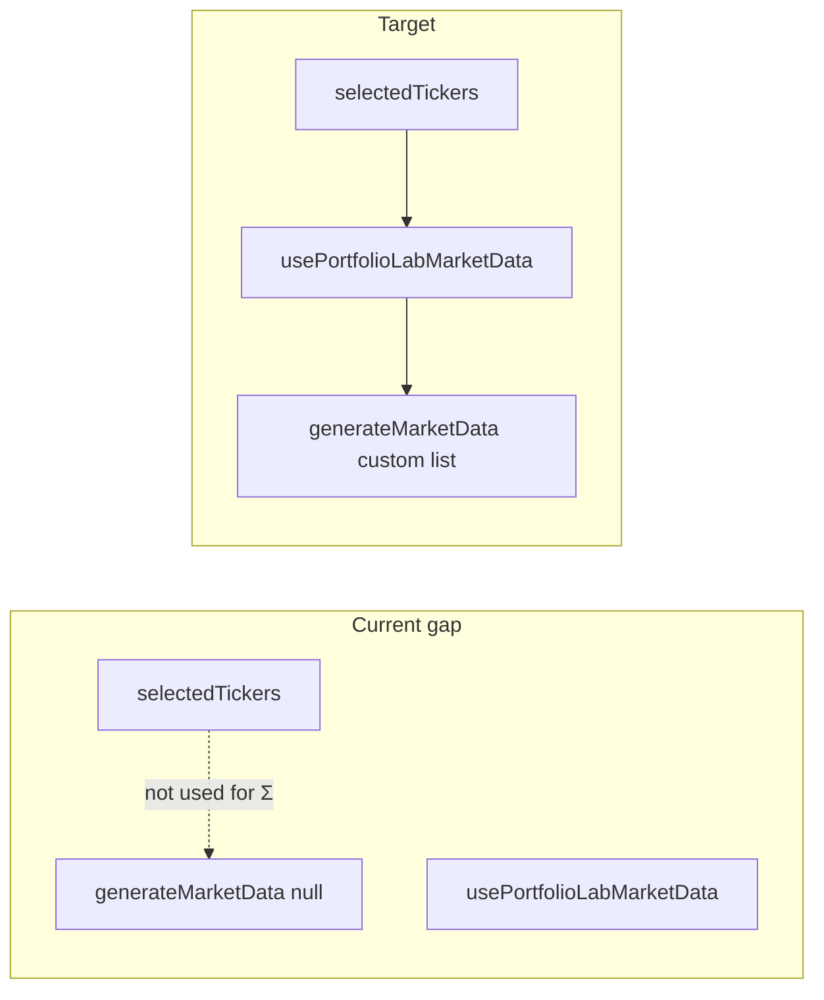

# Portfolio Lab: tickers, methods, and report alignment

## Problem (root cause)

- `[web/src/hooks/usePortfolioLabMarketData.ts](web/src/hooks/usePortfolioLabMarketData.ts)` calls `generateMarketData(..., null)`, so **synthetic** runs ignore **Universe tickers** and use the first N names from `[DEFAULT_TICKERS](web/src/lib/simulationEngine.js)` instead.
- **Live** mode keeps the previous `liveLabData` until **Load market data** runs again; changing tickers/dates does not clear it, so users can optimize on a **stale** panel.
- **Objective switching** is already correct: `[handleRunOptimize](web/src/components/CustomizableQuantumDashboard.js)` and `[buildLabRunPayload](web/src/components/CustomizableQuantumDashboard.js)` read current `data` + `objective`. Wrong results come from **stale or mislabeled `data`**, not from caching the objective.

## Implementation plan

### 1. Pass selected symbols into synthetic generation

- Extend `usePortfolioLabMarketData` to accept a `**customTickerList: string[]**` (or derive internally from `tickerInput`—prefer passing `**selectedTickers**` from the dashboard to avoid duplicate parsing).
- Update the `useMemo` for synthetic data to call:
`generateMarketData(nAssets, 504, regime, dataSeed, customTickerList.length ? customTickerList : null)`
- **Dependency array** must include `customTickerList` (stable: e.g. `selectedTickers` from parent, or memoized joined list).
- **Alignment with `nAssets`**: The dashboard already constrains the **Universe size** slider when `selectedTickers.length > 0` (`[CustomizableQuantumDashboard.js](web/src/components/CustomizableQuantumDashboard.js)` ~2025–2034). Keep that invariant: when there is a non-empty selection, effective universe size should remain `min(nAssets, selectedTickers.length)` or auto-clamp `nAssets` when the selection shrinks (existing effect only shrinks when `nAssets > selectedTickers.length`; consider also capping when the list is shorter than `nAssets` after edits—verify edge cases: empty selection falls back to synthetic default list + slider-only `nAssets`).

### 2. Invalidate stale live data when inputs change

- In `[usePortfolioLabMarketData.ts](web/src/hooks/usePortfolioLabMarketData.ts)`, when `marketMode === "live"`, **clear `liveLabData`** (and optionally show error cleared) when any of these change: parsed ticker list from `tickerInput`, `startDate`, or `endDate`. This forces **Load market data** before the next optimize, matching user expectation that “new tickers = new panel.”
- Avoid clearing on synthetic→live switch in a way that fights the existing effect that clears live when switching to synthetic (already present).

### 3. Optional UX copy

- If helpful, add one line near **Load market data** when live data was cleared due to input change: e.g. “Settings changed — load again.” (Minimal string; no new dependencies.)

### 4. Reports and saved runs (verify only)

- `[buildLabRunPayload](web/src/components/CustomizableQuantumDashboard.js)` already sets `tickers`, `data_mode`, `regime`. After step 1–2, `data.assets[].name` will match the intended universe; **Save run** / `[createLabRun](web/src/lib/api.ts)` and `[setLastOptimize](web/src/context/LedgerSessionContext.tsx)` will automatically align.
- Optional small enhancement: add `**returnsSource`** / `**covarianceSource`** from the hook into `buildLabRunPayload` for auditability (hook already exposes them). Only if the API/schema accepts extra fields—grep `createLabRun` / backend schema before adding.

### 5. Tests

- Add or extend a focused test:
  - **Unit**: mock-free test that `generateMarketData(n, …, ["X","Y",…])` uses those names for the first `n` assets (may already be indirectly covered).
  - **Hook-level** (if practical): with React Testing Library or a thin pure helper extracted from the hook, assert that changing `customTickerList` changes `data.assets[].name` in synthetic mode.
- Run existing `[web/src/lib/marketDataAdapter.test.ts](web/src/lib/marketDataAdapter.test.ts)` and dashboard-related tests after changes.

## Files to touch

| File                                                                                                       | Change                                                                             |
| ---------------------------------------------------------------------------------------------------------- | ---------------------------------------------------------------------------------- |
| `[web/src/hooks/usePortfolioLabMarketData.ts](web/src/hooks/usePortfolioLabMarketData.ts)`                 | Pass custom ticker list into `generateMarketData`; invalidate live on input change |
| `[web/src/components/CustomizableQuantumDashboard.js](web/src/components/CustomizableQuantumDashboard.js)` | Pass `selectedTickers` into the hook; sanity-check `nAssets` vs selection          |
| Tests under `web/`                                                                                         | New or updated test for synthetic names / hook behavior                            |

## Validation (manual)

1. **Simulated**: Select a preset or custom tickers; confirm chart/heatmap labels and optimize payload names match the selection; change tickers and confirm Σ/labels update without needing live load.
2. **Live**: Load once; change one ticker or date; confirm green “loaded” state clears until **Load** again; optimize and **Save run**; open report run page and confirm tickers match.
3. **Objective**: With fixed `data`, switch objectives and run API optimize; confirm weights/Sharpe change (same `data`, different `objective`).

## Risks / tradeoffs

- **Clearing live data on every ticker/date edit** resets the loaded panel until reload—correct but slightly more clicks; acceptable for correctness.
- **Very short ticker lists** with high `nAssets`: rely on existing slider caps and `generateMarketData` fallback names (`A{i}`) for overflow—document or clamp `nAssets` to selection length when selection is non-empty.

## Out of scope (parking lot)

- Auto-fetch live data on debounced ticker change (API cost / rate limits).
- PDF/print chart work from the separate todo list.

