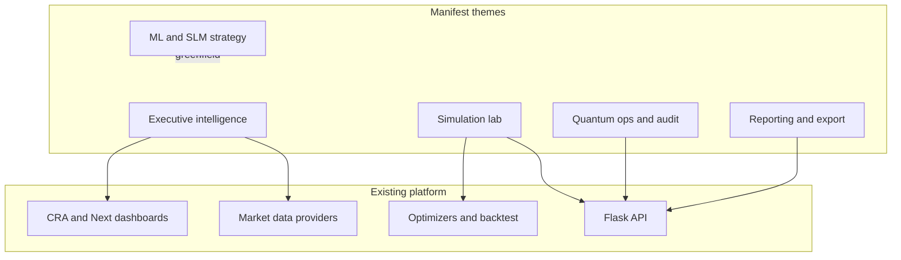

# Quantum Ledger: Manifest to Execution Plan

## Context

The manifest describes a **broad product vision** (“Quantum Ledger”) spanning executive dashboards, ML ensemble configuration, macro/sentiment simulation, quantum telemetry, and enterprise reporting. In-repo, **“The Quantum Ledger”** is already the **design north star** (`[stitch_strategy_ml_config_market_optimization_new/.../quantum_ledger/DESIGN.md](stitch_strategy_ml_config_market_optimization_new/stitch_strategy_ml_config_market_optimization/quantum_ledger/DESIGN.md)`, mirrored in `[docs/design/DESIGN.md](docs/design/DESIGN.md)`).

The **current platform** is a **quantum-inspired portfolio optimization stack**: Flask `[api.py](api.py)` (optimize, backtest, market-data, efficient frontier, IBM Quantum config, JWT/metrics), `[core/](core/)` optimizers (hybrid, QUBO-SA, VQE, classical), `[services/data_provider_v2.py](services/data_provider_v2.py)`, and UIs in `[frontend/](frontend/)` and `[web/](web/)` (`[CustomizableQuantumDashboard.js](web/src/components/CustomizableQuantumDashboard.js)` on `/portfolio`). Most manifest bullets are **not yet implemented**; treat them as **roadmap themes**, not current features.

---

## Gap summary (manifest vs codebase)

| Theme                | Manifest asks for                                                                                | Today (honest)                                                                                                                               |
| -------------------- | ------------------------------------------------------------------------------------------------ | -------------------------------------------------------------------------------------------------------------------------------------------- |
| **1. Executive**     | Live NAV, vs S&P, multi-asset-class allocation, top-asset tracking, optimization feed            | Simulated + API optimization; sector/holdings views; **no** linked brokerage/live portfolio or persistent “feed” product                     |
| **2. Strategy / ML** | LSTM/Transformer ensembles, attention tuning, news/sentiment SLM, node Logic Canvas, YAML export | **Config** via API/presets (`[config/api_config.py](config/api_config.py)`); **no** training pipelines, SLM, or visual logic editor          |
| **3. Simulation**    | Scenario compare, macro injection, sentiment deep-dives, MC matrices, pathways                   | Backtest + UI stress cards; **partial** MC/VaR discussion in docs (`[docs/misc/qwen.md](docs/misc/qwen.md)`); **no** macro-injection product |
| **4. Quantum core**  | Gate fidelity, entanglement sync, mK temps, PFLOPS advantage, job queue, Hamiltonian audit       | IBM **connection status**; classical/Q-inspired **jobs**; **no** device-grade telemetry or quantum audit line-by-line as described           |
| **5. Reporting**     | PDF/CSV/JSON/API, compliance, granular telemetry                                                 | **JSON API** + export patterns; **no** PDF/compliance report builder                                                                         |

---

## Recommended phases (dependency-ordered)

### Phase A — Platform and naming (enables everything else)

- Finish **Track D** UI migration where it matters: stable Next routes, parity with `[frontend/src/services/api.js](frontend/src/services/api.js)` / `[web/src/lib/api.ts](web/src/lib/api.ts)`, then cutover per `[docs/plans/MIGRATION_PHASES_AND_CHECKPOINTS.md](docs/plans/MIGRATION_PHASES_AND_CHECKPOINTS.md)`.
- Optionally add a **single canonical doc** (e.g. under `[docs/next-phase/](docs/next-phase/)` or `[docs/plans/](docs/plans/)`) that defines **“Quantum Ledger”** as the product experience name and maps manifest pillars → epics (this plan can seed that doc).
- Keep **dev workflow** documented: `[scripts/dev.sh](scripts/dev.sh)` + `[docs/next-phase/README.md](docs/next-phase/README.md)`.

### Phase B — Executive intelligence (incremental, data-dependent)

- **Benchmarks vs “live” portfolio**: Define data model: paper portfolio + positions + benchmark index (e.g. SPY). Extend API with read models and time series (reuse market data services).
- **Overview UI**: Executive strip (NAV trend, vs benchmark, allocation by asset class) aligned with Stitch tokens (`[docs/design/DESIGN.md](docs/design/DESIGN.md)`).
- **Optimization feed**: Append-only **event log** (optimization runs, rebal alerts, training jobs later) backed by DB or append-only store; surface in UI “feed” module.

### Phase C — Simulation and rapid testing (extends existing backtest/optimize)

- **Scenario comparison**: API to run **N scenarios** (weights, shocks) and return comparable metrics; UI side-by-side or overlay (reuse chart patterns from dashboard).
- **Macro / stress templates**: Parameterized shocks (rates, equity beta) — start **simple factors** before “geopolitical” narrative UI.
- **Monte Carlo / matrices**: Optional integration with existing optimizer/backtest path; scope **one** MC methodology first (align with `[docs/planning/PORTFOLIO_CUSTOMIZATION_ROADMAP.md](docs/planning/PORTFOLIO_CUSTOMIZATION_ROADMAP.md)` where relevant).

### Phase D — Advanced strategy, ML, SLM (largest lift; separate workstream)

- **Strategy Architect (MVP)**: Externalize **YAML/JSON configs** for pipelines (manifest export) before full ensemble UI.
- **Model registry + training**: Not in current repo — requires **new services** (jobs, artifacts, evaluation). LSTM/Transformer claims imply **ML platform** work, not a single PR.
- **SLM / sentiment**: Ingestion + feature store + gating signals into allocation — **research + compliance** boundary; treat as optional phase.
- **Logic Canvas**: Node editor is **greenfield** (frontend complexity + execution engine); defer until config API and simulation APIs are stable.

### Phase E — Quantum operations and audit (realistic scope)

- **Job queue**: Formalize async jobs for long optimizers (executor + status endpoints); map to “Active Task Queue” UX with honest labels (simulator vs hardware).
- **Telemetry**: Show **provider-reported** metrics where APIs exist (IBM, Braket); avoid inventing **gate fidelity / mK** unless tied to real device payloads.
- **Audit trail**: Structured logs (hash-linked or append-only) for optimization inputs/outputs and quantum job metadata — **compliance-oriented**, not physics-level Hamiltonian dumps unless you own that data.

### Phase F — Reporting and export

- **CSV/JSON**: Batch export endpoints for runs, scenarios, and audit entries.
- **PDF / compliance**: Template engine + scheduled reports — typically **last**, after metrics and audit schema are fixed.

---

## Success criteria (manifest-aligned)

- **Phase B–C**: User can run a defined portfolio narrative (positions + benchmark + scenarios) in UI with API backing; feed shows real system events.
- **Phase D**: At least **config manifest export** + optional **one** ML path documented; SLM/Canvas only if explicitly funded.
- **Phase E**: Queue + audit + honest quantum **status** (no fabricated hardware numbers).
- **Phase F**: Export formats agreed and tested.

---

## Risks and constraints

- **“Production-ready” + specific quantum numbers** (99.99% gates, 12.4 mK): Only viable with **real device integrations** and vendor APIs; keep manifest language **conditional** in customer-facing docs.
- **SLM / news / social**: Legal, licensing, and model risk — plan **governance** before build.
- **Scope creep**: The manifest is multi-year; tie each epic to **one** measurable outcome per phase.

---

## Documentation touchpoints (when executing)

- Update `[docs/ARCHITECTURE.md](docs/ARCHITECTURE.md)` when new subsystems (feed, jobs, ML) appear.
- Align UI with `[docs/design/DESIGN.md](docs/design/DESIGN.md)` and Stitch quantum_ledger references.
- Keep `[docs/next-phase/ENGINEERING_BACKLOG.md](docs/next-phase/ENGINEERING_BACKLOG.md)` in sync with phased epics.

