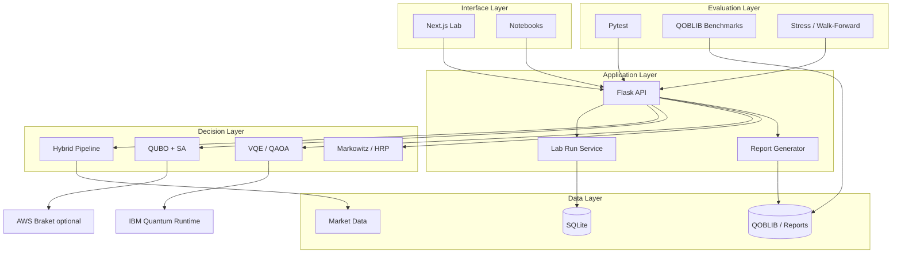
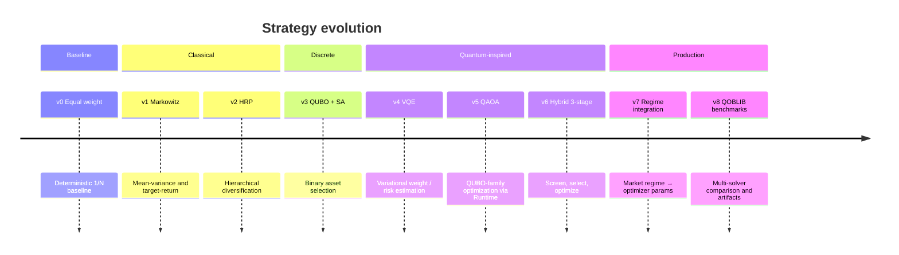
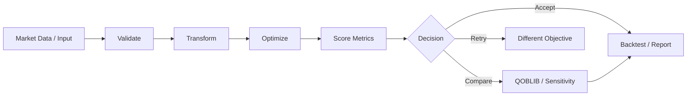
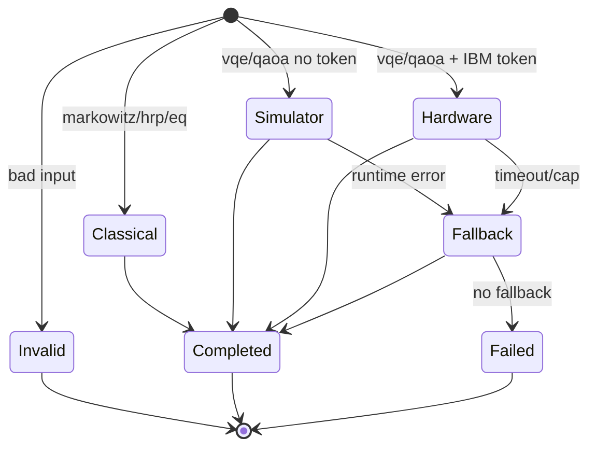
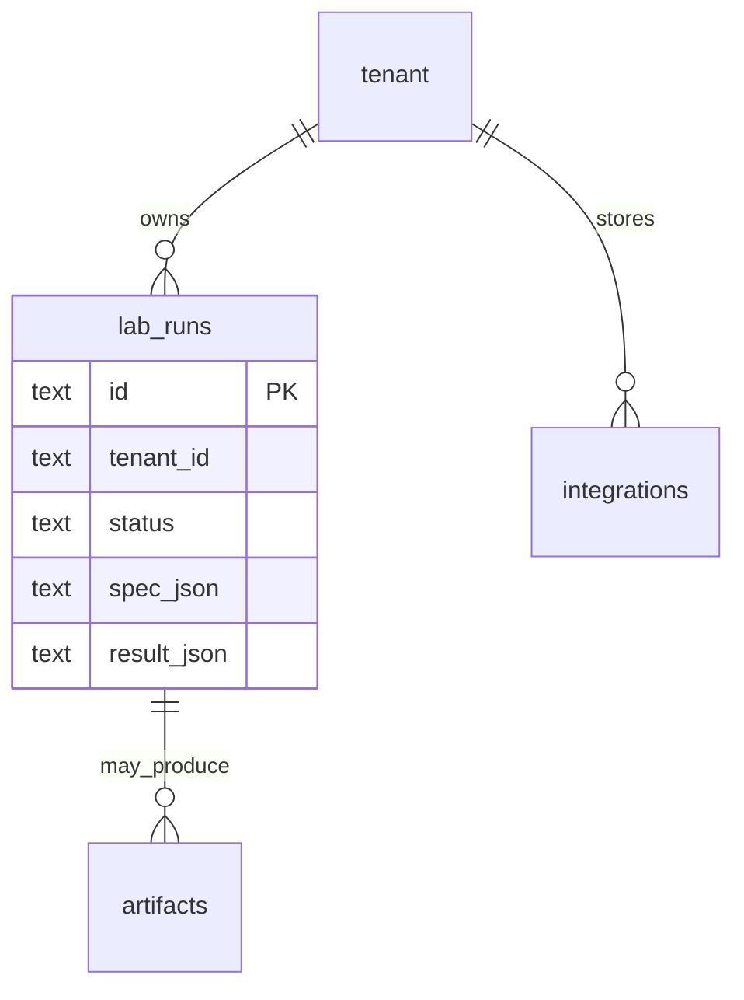
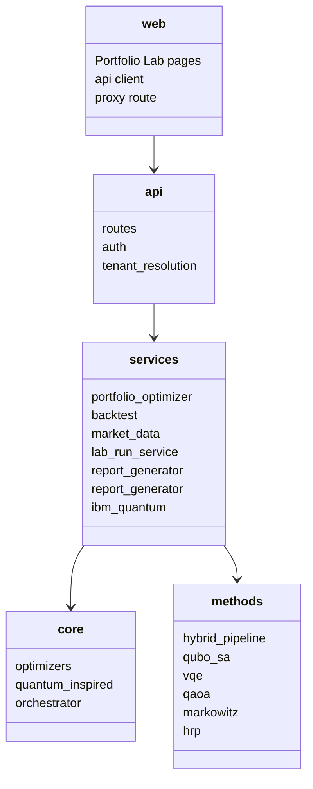
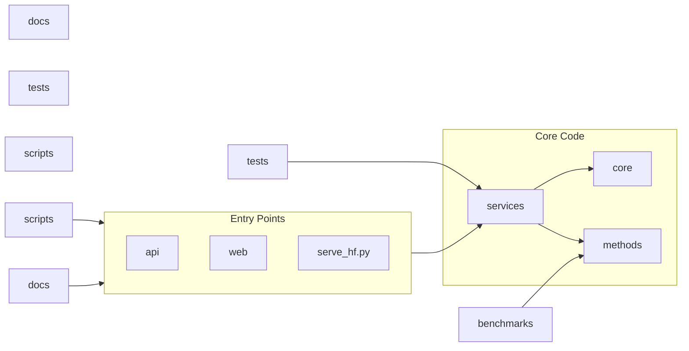

# Quantum Hybrid Portfolio

[](https://www.python.org/downloads/)
[](https://opensource.org/licenses/MIT)

Quantum-inspired portfolio optimization on classical hardware — hybrid pipelines, QUBO+SA, VQE, QAOA, and classical methods for robust allocations without requiring quantum hardware.

| Audience | Start Here |
|---|---|
| New reader | [Problem statement](#problem-statement) |
| Operator | [Current phase](#current-phase) and [Getting started](docs/GETTING_STARTED.md) |
| Engineer | [Architecture](#architecture) and [Repository layout](#repository-layout) |
| Researcher | [Strategy stack](#strategy-stack) and [Evaluation](#evaluation) |
| Diagrams | [Visual reference](#visual-reference) |

## Reading Order

1. [Problem statement](#problem-statement)
2. [Project analysis](#project-analysis)
3. [Visual map](#visual-map)
4. [Architecture](#architecture)
5. [Strategy stack](#strategy-stack)
6. [Core pipeline](#core-pipeline)
7. [Data model](#data-model)
8. [Repository layout](#repository-layout)
9. [Quick start](#quick-start)
10. [Current phase](#current-phase)
11. [Visual reference](#visual-reference)

---

## Problem Statement

Traditional mean-variance optimization is sensitive to estimation error and often produces unstable or extreme weights. Portfolio operators need:

- **Robust allocations** across classical and quantum-inspired solvers
- **Traceable runs** from market data through optimization to backtest and PDF export
- **Optional IBM Quantum / Braket paths** with explicit classical fallbacks
- **An operator UI** (Next.js Portfolio Lab) and a **REST API** for automation

This project delivers a unified optimization platform: screening, discrete selection, and continuous weight refinement — with reproducible artifacts and tenant-scoped credentials.

---

## Project Analysis

| Dimension | Summary |
|---|---|
| Domain | Portfolio optimization, backtesting, sensitivity analysis, QOBLIB benchmarking |
| Runtime | Flask API (`python -m api`, port 5000), Next.js UI (`web/`, port 3042) |
| Decision layer | Hybrid 3-stage pipeline, QUBO+SA, VQE, QAOA, Markowitz, HRP, equal-weight, target-return |
| Data | Tiingo (primary) or yfinance (fallback); SQLite tenant DB (`API_DB_PATH`) |
| Evaluation | Pytest, QOBLIB benchmark harness, walk-forward / stress simulations in UI |
| Deploy | Docker, Fly.io (two-app), Vercel (two-project), Hugging Face Spaces |

Full narrative: [docs/PROJECT_OVERVIEW.md](docs/PROJECT_OVERVIEW.md).

---

## Visual Map

This project uses diagrams and generated charts to explain system behavior.

| Visual | Purpose |
|---|---|
| Architecture diagram | Shows API, UI, services, optimizers, and external backends |
| Pipeline diagram | Shows market data → optimize → score → backtest → report |
| Sequence diagram | Shows runtime behavior between UI, API, and optimizers |
| State diagram | Shows objective routing and IBM/classical fallback gates |
| ER diagram | Shows core SQLite entities and run traceability |
| Package diagram | Shows code boundaries (`api`, `services`, `core`, `methods`) |
| Strategy timeline | Shows evolution from classical baselines to quantum-inspired layers |
| Generated charts | Backtests, QOBLIB benchmarks, sensitivity heatmaps |

---

## Architecture

Quantum Hybrid Portfolio is organized into five layers:

| Layer | Responsibility |
|---|---|
| Interface | Next.js Portfolio Lab (`web/`), CLI scripts, notebooks |
| Application | Flask routes (`api/app.py`), lab run service, async jobs, report generator |
| Decision | Hybrid pipeline, QUBO-SA, VQE, QAOA, Markowitz, HRP, regime-aware presets |
| Data | SQLite (`lab_runs`, tenant integrations), market cache, QOBLIB CSV/JSON artifacts |
| Evaluation | Pytest, QOBLIB harness, walk-forward/stress tabs, PDF export pre-flight |



Deeper breakdown: [docs/ARCHITECTURE.md](docs/ARCHITECTURE.md). Hosting topology: [docs/HOSTING_NEXT_AND_FLASK_ARCHITECTURE.md](docs/HOSTING_NEXT_AND_FLASK_ARCHITECTURE.md).

---

## Strategy Stack

Optimization methods share a single entry point: `services.portfolio_optimizer.run_optimization`.

| Layer | Method | Role |
|---|---|---|
| Baseline | `equal_weight` | 1/N reference |
| Classical | `markowitz`, `min_variance`, `target_return` | Mean-variance family |
| Diversification | `hrp` | Hierarchical Risk Parity (López de Prado) |
| Discrete | `qubo_sa` | QUBO + simulated annealing (Orús et al.) |
| Variational | `vqe`, `qaoa`, `hybrid_qaoa` | IBM Runtime or classical fallback |
| Hybrid | `hybrid` | 3-stage IC screen → selection → Markowitz (Buonaiuto/Herman 2025) |

```python
from services.portfolio_optimizer import run_optimization

result = run_optimization(returns, covariance, objective="hybrid")
result = run_optimization(returns, covariance, objective="qubo_sa")
result = run_optimization(returns, covariance, objective="vqe")
```

Legacy API aliases (`max_sharpe` → `markowitz`, `risk_parity` → `hrp`) are mapped in the service layer.

### Strategy Evolution

The strategy is cumulative. Later layers extend earlier safety checks rather than replacing them.



Research basis: [docs/TECHNICAL_PAPER.md](docs/TECHNICAL_PAPER.md).

---

## Core Pipeline

The project follows a repeatable input-to-output pipeline.

| Step | Purpose | Output |
|---|---|---|
| Ingest | Fetch prices (Tiingo / yfinance) or accept user matrices | Returns, covariance |
| Validate | Schema, ticker coverage, constraint bounds | Validated input |
| Transform | Regime detection, universe filtering, preset application | Processed spec |
| Analyze | Run selected optimizer (hybrid, QUBO, VQE, classical) | Candidate weights |
| Score | Sharpe, volatility, turnover, constraint satisfaction | Metrics + provenance |
| Review | Operator inspects Lab UI, sensitivity, or QOBLIB run | Accepted allocation |
| Output | Persist run, backtest, PDF report, or QOBLIB artifact | Final artifact |



Pipeline ownership: [docs/DATA_PIPELINE.md](docs/DATA_PIPELINE.md).

---

## Runtime Flow

Typical Portfolio Lab optimize request:

```mermaid
sequenceDiagram
  participant User
  participant UI as Next.js Lab
  participant API as Flask API
  participant Opt as Portfolio Optimizer
  participant MD as Market Data
  participant DB as SQLite

  User->>UI: Configure universe and objective
  UI->>API: POST /api/portfolio/optimize
  API->>MD: Fetch or validate returns/covariance
  API->>Opt: run_optimization(...)
  Opt->>Opt: Hybrid / QUBO / VQE / classical path
  alt IBM token present
    Opt->>Opt: IBM Runtime attempt
  else No token or failure
    Opt->>Opt: Classical fallback
  end
  Opt->>API: Weights + metrics + provenance
  API->>DB: Persist lab_run optional
  API->>UI: JSON result
  User->>UI: Backtest or export PDF
```

---

## Decision States

Objective and backend routing for optimization requests:

| State | Meaning | Action |
|---|---|---|
| Invalid input | Missing returns/covariance or constraint violation | Stop and return 400 |
| Classical path | Objective is markowitz/hrp/equal_weight | Run classical solver |
| Simulator | VQE/QAOA without IBM token | Classical or local simulator fallback |
| Hardware candidate | IBM token + runtime objective | Attempt IBM Quantum Runtime |
| Fallback | Runtime error or cap exceeded | Log and use classical/QUBO-SA path |
| Completed | Weights and metrics produced | Return result + optional run_id |
| Failed | Unrecoverable solver error | Persist error on lab_run |



IBM credential flow: [docs/ibm-quantum-credentials.md](docs/ibm-quantum-credentials.md).

---

## Data Model

The data model preserves traceability from request to stored run and export.

| Table / Entity | Purpose |
|---|---|
| `lab_runs` | Async/sync optimization runs (spec, result, status, tenant) |
| Tenant integrations | IBM Quantum token, optional instance CRN (per `tenant_id`) |
| `api_keys` | Optional per-tenant API keys |
| Market cache | In-memory TTL cache for price panels |
| QOBLIB artifacts | `results/qoblib/runs/{run_id}.json`, `results/qoblib/results.csv` |
| PDF artifacts | Generated on demand via WeasyPrint (Fly/local only) |



Full pipeline map: [docs/DATA_PIPELINE.md](docs/DATA_PIPELINE.md).

---

## Package Boundaries

The codebase separates routes, services, optimizers, methods, and UI.



---

## Repository Layout

```text
quantum-hybrid-portfolio/
├── api/                        # Flask REST API (python -m api)
├── core/
│   ├── optimizers/             # equal_weight, markowitz, hrp, qubo_sa, vqe, qaoa
│   ├── quantum_inspired/       # Braket, QAOA, VQE risk, quantum walks
│   └── orchestrator/           # End-to-end pipeline orchestration
├── methods/                    # Optimizer implementations
├── services/                   # Business logic, market data, IBM Quantum, reports
├── web/                        # Next.js dashboard (PRIMARY UI, port 3042)
├── deps/                       # Python requirements — see deps/README.md
├── deploy/docker/              # Dockerfiles + compose — see deploy/docker/README.md
├── scripts/                    # dev.sh, run-next-web.sh, deploy helpers
├── config/                     # api_config, presets, settings
├── configs/                    # Externalized run/experiment configs
├── data/                       # Sample data; SQLite when local (API_DB_PATH)
├── benchmarks/qoblib/          # QOBLIB benchmark harness
├── tests/                      # Pytest suite
├── notebooks/                  # Research walkthroughs
├── templates/                  # Jinja2 PDF report templates
├── legacy/                     # Archived stack — see legacy/README.md
└── docs/                       # Documentation — see docs/DOCUMENTATION_INDEX.md
```



Top-level config: `pyproject.toml`, `vercel.json`, `fly.toml`, `AGENTS.md`.

---

## Quick Start

### 1. Install dependencies

```bash
pip install -r deps/requirements.txt
pip install -e .
```

### 2. Configure environment

```bash
cp .env.example .env
# Edit .env — API_KEY, TIINGO_API_KEY, CORS_ORIGINS as needed
```

### 3. Run quick test

```bash
python tests/quick_test.py
```

### 4. Start the API

```bash
python -m api
```

API: **http://localhost:5000** — health: `/api/health`, OpenAPI: `/api/docs/openapi`

### 5. Launch dashboard

**Next.js (primary):**

```bash
cd web && npm install && cd ..
./scripts/run-next-web.sh        # NEXT_WEB_PORT default 3042
```

Or start Flask + Next together: `./scripts/dev.sh` (`--api-only`, `--next-only` supported).

Full guide: [docs/GETTING_STARTED.md](docs/GETTING_STARTED.md). Public demo: [docs/PUBLIC_DEMO.md](docs/PUBLIC_DEMO.md).

---

## API Endpoints

| Endpoint | Method | Description |
|---|---|---|
| `/api/health` | GET | Health check |
| `/api/config/objectives` | GET | Available optimization objectives |
| `/api/config/presets` | GET | Strategy presets |
| `/api/portfolio/optimize` | POST | Optimize portfolio |
| `/api/portfolio/backtest` | POST | Run backtest |
| `/api/portfolio/efficient-frontier` | POST | Compute efficient frontier |
| `/api/market-data` | POST | Fetch market data |
| `/api/jobs/optimize` | POST | Submit async optimization job |
| `/metrics` | GET | Prometheus metrics |

Example:

```bash
curl -X POST http://localhost:5000/api/portfolio/optimize \
  -H "Content-Type: application/json" \
  -d '{
    "returns": [0.1, 0.12, 0.08],
    "covariance": [[0.04, 0.01, 0.02], [0.01, 0.05, 0.03], [0.02, 0.03, 0.03]],
    "objective": "max_sharpe"
  }'
```

Reference: [docs/API_REFERENCE.md](docs/API_REFERENCE.md).

---

## Configuration

| Variable | Default | Description |
|---|---|---|
| `FLASK_ENV` | production | Environment mode |
| `LOG_LEVEL` | INFO | Logging level |
| `API_KEY` | (none) | API key for authentication |
| `API_KEY_REQUIRED` | false | Require API key |
| `API_DB_PATH` | `data/api.sqlite3` | SQLite path for tenants and runs |
| `DATA_PROVIDER` | tiingo if key set | Market data provider |
| `TIINGO_API_KEY` | (none) | Tiingo API key |
| `CORS_ORIGINS` | `http://localhost:3000` | Allowed browser origins |
| `CACHE_TTL` | 3600 | Market data cache TTL |
| `AWS_REGION` | us-east-1 | AWS region for Braket |
| `BRAKET_DEVICE_ARN` | (none) | Braket device ARN |

See `.env.example` for the full list.

---

## Evaluation

Evaluation spans automated tests, QOBLIB benchmarks, and UI-driven simulations.

| Channel | Purpose |
|---|---|
| `pytest tests/` | Unit and integration coverage for `core`, `services`, `api` |
| QOBLIB harness | Six solvers, fixture instances, JSON/CSV/Markdown artifacts |
| Portfolio Lab | Sensitivity sweeps, stress tests, walk-forward tabs |
| PDF export | WeasyPrint reports (local / Fly.io; not Vercel serverless) |

Generated chart assets (when present) live under [docs/assets/](docs/assets/README.md). Do not reference assets until they exist.

QOBLIB details: [docs/QOBLIB_IBM_RUNTIME.md](docs/QOBLIB_IBM_RUNTIME.md), [docs/PORTFOLIO_LAB_QOBLIB_OVERHAUL.md](docs/PORTFOLIO_LAB_QOBLIB_OVERHAUL.md).

---

## Testing

```bash
pytest tests/
pytest tests/test_api_integration.py
pytest --cov=core --cov=services tests/
```

CI mirrors `.github/workflows/ci.yml` (Python 3.11/3.12 + Next lint/build).

---

## Docker Deployment

```bash
docker compose -f deploy/docker/docker-compose.yml up -d
# API: http://localhost:5000
# Frontend: http://localhost:80
# Prometheus: http://localhost:9090
```

Deploy guides: [docs/DEPLOYMENT.md](docs/DEPLOYMENT.md), [docs/FLY_DEPLOY.md](docs/FLY_DEPLOY.md), [docs/VERCEL_TWO_PROJECTS.md](docs/VERCEL_TWO_PROJECTS.md), [docs/HUGGINGFACE_SPACES.md](docs/HUGGINGFACE_SPACES.md).

---

## Current Phase

Detailed May 2026 overhaul log: [docs/PORTFOLIO_LAB_QOBLIB_OVERHAUL.md](docs/PORTFOLIO_LAB_QOBLIB_OVERHAUL.md).

### Phase 1 — Optimizer Foundations (Complete)

- Hybrid 3-stage pipeline, QUBO-SA, VQE, QAOA, HRP, Markowitz, equal-weight, target-return
- Unified `services.portfolio_optimizer.run_optimization`
- CRA (`frontend/`) and Next.js (`web/`) dashboards
- Repo restructure: `deps/`, `deploy/docker/`, `legacy/`

### Phase 2 — Portfolio Lab + QOBLIB Overhaul (Complete)

- Tiingo market data; 250-asset universe; regime → optimizer integration
- Portfolio book accuracy, sensitivity page, QOBLIB benchmarking layer
- Simulations 4-tab layout; WeasyPrint PDF export

### Phase 3 — Active Gaps

- [x] QOBLIB IBM Quantum adapter v1
- [ ] Tiingo error surfacing + synthetic-mode fallback banner
- [ ] `GET /api/reports/capabilities` PDF pre-flight endpoint
- [x] `POST /api/portfolio/sensitivity-sweep`
- [x] QAOA-sim fixture regression + validate harness
- [x] Per-card stale badges on Portfolio book
- [ ] localStorage size guard on saved universes
- [ ] Distinguish auth-error vs data-error in regime auto-detect
- [x] QOBLIB run list from `results/qoblib/results.csv`
- [ ] OS-aware `scripts/install_pdf_deps.sh` for WeasyPrint

### Phase 4 — Research Modules (not yet wired into Lab/QOBLIB)

- [ ] Quantum linear algebra (`core/quantum_inspired/quantum_linear_algebra.py`)
- [ ] Quantum ML (`core/quantum_inspired/quantum_ml.py`)
- [ ] TensorFlow Quantum integration

---

## Documentation

| Document | Description |
|---|---|
| [docs/GETTING_STARTED.md](docs/GETTING_STARTED.md) | Install, run API, run dashboard, troubleshooting |
| [docs/ARCHITECTURE.md](docs/ARCHITECTURE.md) | System architecture (extended) |
| [docs/DATA_PIPELINE.md](docs/DATA_PIPELINE.md) | Scripts, methods, DB layout |
| [docs/API_REFERENCE.md](docs/API_REFERENCE.md) | API reference |
| [docs/DASHBOARD_GUIDE.md](docs/DASHBOARD_GUIDE.md) | Dashboard user guide |
| [docs/PUBLIC_DEMO.md](docs/PUBLIC_DEMO.md) | Public demo and disclaimers |
| [docs/DOCUMENTATION_INDEX.md](docs/DOCUMENTATION_INDEX.md) | Full documentation index |
| [examples/](examples/) | Code examples |

---

## Visual Reference

| Visual | Section |
|---|---|
| Architecture | [Architecture](#architecture) |
| Pipeline | [Core Pipeline](#core-pipeline) |
| Runtime sequence | [Runtime Flow](#runtime-flow) |
| Decision states | [Decision States](#decision-states) |
| Data model | [Data Model](#data-model) |
| Package boundaries | [Package Boundaries](#package-boundaries) |
| Repository layout | [Repository Layout](#repository-layout) |
| Strategy timeline | [Strategy Evolution](#strategy-evolution) |
| Generated charts | [Evaluation](#evaluation) |

Extended diagrams belong in [docs/ARCHITECTURE.md](docs/ARCHITECTURE.md) and [docs/assets/](docs/assets/README.md) when README grows too long.

---

## Contributing

1. Fork the repository
2. Create a feature branch (`git checkout -b feature/amazing-feature`)
3. Commit your changes
4. Push and open a Pull Request

---

## Research Basis

- **Buonaiuto/Herman (2025)** — 3-stage hybrid pipeline
- **López de Prado (2016)** — Hierarchical Risk Parity
- **Farhi et al. (2014)** — QAOA
- **Peruzzo et al. (2014)** — VQE

---

## License

MIT — see [LICENSE](LICENSE).

---

## Citation

```bibtex
@software{quantum_hybrid_portfolio,
  author = {Quantum Global Group},
  title = {Quantum Hybrid Portfolio: Quantum-Inspired Optimization},
  year = {2026},
  url = {https://github.com/Quantum-Global-Group/quantum-hybrid-portfolio}
}
```

---

## Support

- **Documentation:** [docs/](docs/)
- **Issues:** [GitHub Issues](https://github.com/Quantum-Global-Group/quantum-hybrid-portfolio/issues)
- **API guide:** [docs/API_PRODUCT_GUIDE.md](docs/API_PRODUCT_GUIDE.md)
