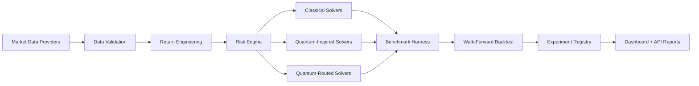
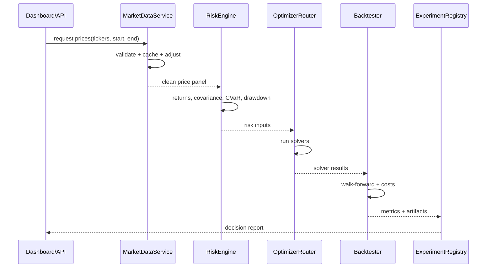

# Target Architecture

## System goal

The system should behave like a market optimization research lab:



## Proposed repo layout

```text
quantum-hybrid-portfolio/
  api/
    main.py
    routes/
      optimize.py
      backtest.py
      market_data.py
      quantum.py
      experiments.py

  services/
    market_data/
      base.py
      tiingo_provider.py
      yfinance_provider.py
      cache.py
      validation.py
      corporate_actions.py

    risk/
      covariance.py
      shrinkage.py
      cvar.py
      cdar.py
      drawdown.py
      factor_exposure.py
      regime.py

    optimization/
      constraints.py
      objectives.py
      postprocess.py

    backtesting/
      walk_forward.py
      rebalance.py
      transaction_costs.py
      slippage.py
      metrics.py
      reports.py

    reporting/
      decision_report.py
      allocation_explainer.py

  optimizers/
    schema.py
    router.py

    classical/
      equal_weight.py
      min_variance.py
      max_sharpe.py
      risk_parity.py
      hrp.py
      black_litterman.py
      cvar.py

    quantum_inspired/
      qsw.py
      qubo_simulated_annealing.py

    quantum/
      qaoa_qiskit.py
      braket_annealing.py
      vqe_risk.py

  benchmarks/
    qoblib/
      loader.py
      instances/
      expected_results.json

    synthetic/
      factor_market.py
      correlated_assets.py
      regime_switching.py

    real_market/
      sp500_sector_etfs.yaml
      megacap_ai.yaml
      emerging_tech.yaml

  experiments/
    registry.sqlite
    configs/
    results/
    artifacts/

  web/
    app/
    components/
    lib/api.ts

  docs/
    market-optimization/

  tests/
    test_market_data_validation.py
    test_solver_contracts.py
    test_backtest_no_leakage.py
    test_turnover_constraints.py
    test_quantum_labeling.py
```

## Service boundaries

### `services/market_data`

Responsible for:

- Provider selection
- Price retrieval
- Adjusted close handling
- Missing-data validation
- Stale ticker detection
- Caching
- Corporate action consistency

Should not optimize portfolios.

### `services/risk`

Responsible for:

- Covariance estimation
- Tail-risk estimation
- Drawdown metrics
- Factor exposures
- Concentration metrics
- Regime labels

Should not fetch market data.

### `optimizers`

Responsible for:

- Turning returns, covariance, constraints, and prior weights into allocation results
- Returning a unified `OptimizationResult`
- Exposing solver metadata

Should not own backtesting logic.

### `services/backtesting`

Responsible for:

- Walk-forward loops
- Rebalancing calendars
- Transaction costs
- Slippage
- Out-of-sample metrics
- No-leakage enforcement

Should not contain solver-specific code.

### `experiments`

Responsible for:

- Run configs
- Seeds
- Artifacts
- Metrics
- Reproduction commands
- Result comparison

## Data flow



## API shape

### `POST /optimize`

```json
{
  "tickers": ["NVDA", "AMD", "MSFT", "GOOGL"],
  "start": "2023-01-01",
  "end": "2026-06-01",
  "solver": "cvar",
  "constraints": {
    "max_weight": 0.25,
    "min_weight": 0.0,
    "max_turnover": 0.15
  },
  "data_provider": "tiingo"
}
```

### `POST /backtest`

```json
{
  "tickers": ["NVDA", "AMD", "MSFT", "GOOGL"],
  "start": "2021-01-01",
  "end": "2026-06-01",
  "solvers": ["equal_weight", "hrp", "cvar", "qsw"],
  "rebalance_frequency": "monthly",
  "lookback_days": 252,
  "transaction_cost_bps": 10
}
```

### `GET /experiments/{run_id}`

Returns full run metadata, allocation, solver metrics, cost assumptions, and artifacts.

## Dashboard pages

```text
Dashboard
  Overview
  Data Quality
  Optimizer Comparison
  Risk Breakdown
  Backtest
  Quantum Runs
  Rebalance Recommendation
  Experiment Registry
```

## Design standard

Every major module should support:

- Typed config
- Deterministic seeds
- Structured logs
- Unit tests
- Artifact output
- Dashboard-ready summary
