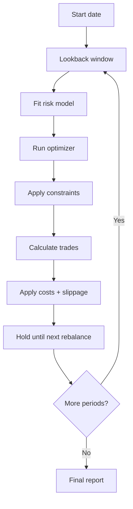

# Backtesting and Experiment Registry

## Purpose

Backtesting determines whether the optimizer survives out-of-sample testing.

The project should not rely on single-period allocation metrics. Every solver needs a walk-forward evaluation with costs, turnover, slippage, and benchmark comparison.

## Target structure

```text
services/backtesting/
  walk_forward.py
  rebalance.py
  transaction_costs.py
  slippage.py
  benchmarks.py
  metrics.py
  reports.py

experiments/
  registry.sqlite
  configs/
  results/
  artifacts/
```

## Backtest config

```python
from dataclasses import dataclass


@dataclass(frozen=True)
class BacktestConfig:
    lookback_days: int = 252
    rebalance_frequency: str = "monthly"
    transaction_cost_bps: float = 10.0
    slippage_bps: float = 5.0
    max_weight: float = 0.25
    min_weight: float = 0.0
    max_turnover: float | None = 0.20
    benchmark: str = "SPY"
```

## Backtest result

```python
from dataclasses import dataclass
import pandas as pd


@dataclass
class BacktestResult:
    solver_name: str
    equity_curve: pd.Series
    returns: pd.Series
    weights_over_time: pd.DataFrame
    trades: pd.DataFrame
    metrics: dict
    solver_runs: list
    config: BacktestConfig
```

## Walk-forward process



## No-leakage rule

For each rebalance date:

```text
Training data: dates <= rebalance_date
Holding period: dates > rebalance_date and <= next_rebalance_date
```

Never use future prices to estimate covariance, returns, regimes, or factor exposures.

## Turnover

```python
def calculate_turnover(
    old_weights: dict[str, float],
    new_weights: dict[str, float],
) -> float:
    tickers = set(old_weights) | set(new_weights)
    return 0.5 * sum(
        abs(new_weights.get(t, 0.0) - old_weights.get(t, 0.0))
        for t in tickers
    )
```

Algorithm type:

- Portfolio turnover metric

## Transaction costs

```python
def apply_transaction_cost(
    gross_return: float,
    turnover: float,
    transaction_cost_bps: float,
    slippage_bps: float,
) -> float:
    total_cost = turnover * ((transaction_cost_bps + slippage_bps) / 10_000)
    return gross_return - total_cost
```

Algorithm type:

- Deterministic cost model

Later upgrades:

- Asset-specific spreads
- Volume participation model
- Volatility-adjusted slippage
- Broker-specific fee simulation

## Benchmark set

Always compare against:

| Benchmark | Purpose |
|---|---|
| Equal weight | Naive allocation |
| SPY | US equity market proxy |
| QQQ | Growth/tech proxy |
| 60/40 | Balanced baseline |
| HRP | Strong robust optimizer |
| CVaR | Tail-risk optimizer |

## Metrics

Backtest reports should include:

```text
CAGR
Annualized volatility
Sharpe
Sortino
Calmar
Max drawdown
CVaR 95
Win rate
Monthly hit rate
Turnover
Total transaction cost
Best month
Worst month
Benchmark excess return
```

## Experiment registry

Use SQLite first.

### Tables

```sql
CREATE TABLE experiments (
    run_id TEXT PRIMARY KEY,
    created_at TEXT NOT NULL,
    git_sha TEXT,
    config_json TEXT NOT NULL,
    data_provider TEXT NOT NULL,
    start_date TEXT NOT NULL,
    end_date TEXT NOT NULL,
    notes TEXT
);

CREATE TABLE solver_results (
    run_id TEXT NOT NULL,
    solver_name TEXT NOT NULL,
    execution_mode TEXT NOT NULL,
    metrics_json TEXT NOT NULL,
    weights_path TEXT,
    artifact_path TEXT,
    PRIMARY KEY (run_id, solver_name)
);

CREATE TABLE data_quality_reports (
    run_id TEXT NOT NULL,
    provider TEXT NOT NULL,
    report_json TEXT NOT NULL
);
```

## Artifact layout

```text
experiments/results/
  2026-06-04_market_optimization_001/
    config.yaml
    data_quality.json
    benchmark_table.csv
    equity_curves.parquet
    weights_over_time.parquet
    trades.parquet
    decision_report.md
    solver_metadata.json
```

## Decision report template

```markdown
# Portfolio Optimization Decision Report

## Recommendation

Use `{solver_name}` for the current rebalance.

## Why

- Best cost-adjusted Sharpe
- Lower CVaR than equal weight
- Turnover within cap
- Lower max drawdown than QSW and max-Sharpe

## Allocation

| Ticker | Weight |
|---|---:|
| NVDA | 18.0% |
| AMD | 12.0% |

## Solver comparison

| Solver | Sharpe | CVaR 95 | Max DD | Turnover |
|---|---:|---:|---:|---:|

## Risk warnings

- Concentration above threshold
- Regime classified as bull/high-vol
- Turnover near max cap

## Reproduction

```bash
python scripts/run_backtest.py --config experiments/configs/current.yaml
```
```

## Tests

### `tests/test_backtest_no_leakage.py`

Required tests:

- Risk model only sees past data
- Rebalance date excludes future returns
- Transaction costs reduce returns
- Turnover is zero when weights do not change
- Backtest results are reproducible with fixed seed
- Experiment registry writes all required artifacts

## Acceptance criteria

Backtesting is complete when:

- Every solver can be walk-forward tested
- Costs and slippage are included
- Benchmarks are always shown
- Results are stored in the experiment registry
- Dashboard can load historical experiment results
