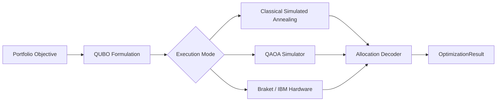

# Quantum Execution and DGX Spark Workflow

## Purpose

The project should be clear about when it is using:

- Classical optimization
- Quantum-inspired local algorithms
- Quantum simulation
- Real quantum hardware

This avoids overstating the quantum contribution and makes benchmarking honest.

## Execution modes

```text
classical_only
quantum_inspired
quantum_simulator
quantum_hardware
```

## Metadata schema

Every quantum or quantum-inspired result should include:

```json
{
  "solver": "qaoa_qiskit",
  "execution_mode": "quantum_simulator",
  "backend": "aer_simulator",
  "hardware_used": false,
  "shots": 4096,
  "queue_time_seconds": null,
  "estimated_cost_usd": 0.0,
  "problem_size": {
    "assets": 8,
    "qubits": 8
  },
  "optimizer": "COBYLA",
  "depth": 2,
  "seed": 20260604
}
```

## Quantum path design



## Recommended quantum modules

```text
optimizers/quantum/
  qubo.py
  qaoa_qiskit.py
  braket_annealing.py
  vqe_risk.py
  execution_metadata.py
  artifact_store.py
```

## QUBO formulation target

The first quantum-routed use case should be **discrete asset selection**, not continuous weight optimization.

Example objective:

```text
minimize:
  risk_penalty - expected_return_reward + cardinality_penalty + turnover_penalty
```

Conceptual QUBO:

```text
x_i ∈ {0, 1}

Objective:
  λ_risk * xᵀΣx
  - λ_return * μᵀx
  + λ_cardinality * (Σx_i - k)²
  + λ_turnover * Σ|x_i - x_prev_i|
```

Then decode selected assets into weights using:

- Equal weight among selected assets
- HRP among selected assets
- CVaR among selected assets
- Risk parity among selected assets

## Why discrete first

Continuous portfolio weights require more encoding complexity. Discrete asset selection is easier to route to:

- QAOA
- Quantum annealing
- Simulated annealing
- Braket demos
- QOBLIB-style benchmark instances

## DGX Spark role

DGX Spark should be used for:

| Workload | DGX value |
|---|---|
| Large benchmark sweeps | Parallel local experimentation |
| Monte Carlo simulation | GPU acceleration |
| RAPIDS/cuDF preprocessing | Faster data transforms |
| Quantum simulation | GPU-backed simulation where supported |
| Experiment registry | Local reproducible artifact generation |
| Agentic orchestration | Liaison / local agents running experiments |

## DGX run profile

```text
DGX profile:
  data_provider: tiingo
  universe: emerging_tech
  solvers:
    - equal_weight
    - hrp
    - cvar
    - qsw
    - qaoa_simulator
  lookback_days: 252
  rebalance_frequency: monthly
  transaction_cost_bps: 10
  slippage_bps: 5
  output_dir: experiments/results/dgx_sweep_001
```

## Command target

```bash
python scripts/run_solver_sweep.py \
  --config experiments/configs/dgx_emerging_tech.yaml \
  --output experiments/results/dgx_sweep_001
```

## Quantum run artifact

```text
experiments/artifacts/quantum/
  qaoa_2026-06-04_001/
    config.yaml
    qubo.json
    circuit.qasm
    backend_metadata.json
    raw_counts.json
    decoded_allocation.json
    optimization_result.json
```

## Dashboard quantum panel

The dashboard should show:

```text
Quantum Run
  Solver: QAOA
  Mode: quantum_simulator
  Backend: Aer simulator
  Assets: 8
  Qubits: 8
  Shots: 4096
  Hardware used: No
  Estimated cost: $0
  Compared against: HRP, CVaR, QSW, Equal Weight
```

## Quantum honesty rules

1. Do not call QSW “hardware quantum.”
2. Do not call QAOA “hardware quantum” unless a real backend was used.
3. Always show simulator vs hardware.
4. Always show problem size.
5. Always compare quantum-routed results to classical baselines.
6. Always store backend metadata.
7. Always include estimated cost when hardware or cloud execution is used.

## Tests

### `tests/test_quantum_labeling.py`

Required tests:

- QSW returns `execution_mode="quantum_inspired"`
- QAOA simulator returns `execution_mode="quantum_simulator"`
- Hardware routes require backend metadata
- Quantum run artifacts include QUBO and decoded allocation
- Dashboard cannot label simulator output as hardware

## Acceptance criteria

Quantum execution is complete when:

- Every quantum result is clearly labeled
- Simulator and hardware routes are separated
- Quantum artifacts are stored
- QAOA starts with small-N asset selection
- Every quantum run is benchmarked against HRP, CVaR, and equal weight
