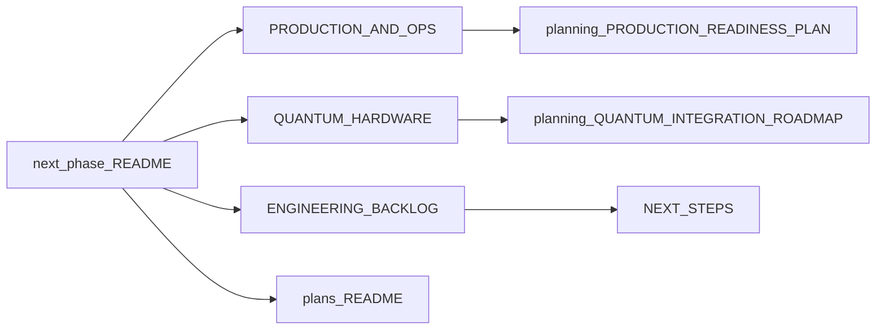

# Next Phase — Execution Hub

This folder is the single hub for work that comes **after** the completed coding phases (Phase 1–3) and industry-standard phases (1–6). All long-form roadmaps live in [`docs/planning/`](../planning/); this folder holds **decisions**, **checklists**, and **execution records**. Extend deep docs in `planning/` rather than duplicating them here.

**Last reviewed:** March 24, 2026

## Scope

- **Post–coding-track**: Quantum optimization core, advanced algorithms, and ML workflows are done.
- **Post–industry-phases**: Many dashboard/API/ops items are implemented; ongoing work is tracked in the backlog and migration plans.
- **Current focus**: Production/ops verification, quantum hardware validation (real devices), remaining backlog items, and **Next.js / UI migration** (see Track D).

## Folder index (read in this order)

| File | Purpose |
|------|---------|
| [ENGINEERING_BACKLOG.md](ENGINEERING_BACKLOG.md) | **Source of truth** for task status (pending vs completed). |
| [PRODUCTION_AND_OPS.md](PRODUCTION_AND_OPS.md) | Deployment decision (HF Spaces vs self-hosted), ops checklist, verification commands. |
| [QUANTUM_HARDWARE.md](QUANTUM_HARDWARE.md) | Provider matrix, milestones, env vars, next steps for real hardware. |
| [../plans/README.md](../plans/README.md) | **Track D:** Next.js + Flask + pipeline phased migration, checkpoints, tests. |
| [EXECUTION_PROMPT.md](EXECUTION_PROMPT.md) | Original prioritized prompt used for the “next phase” push (historical + still-useful rules). |
| [NEXT_PHASE_EXECUTION_SUMMARY.md](NEXT_PHASE_EXECUTION_SUMMARY.md) | Snapshot of completed HIGH-priority work (March 2026). |
| [SESSION_SUMMARY_2026_03_23.md](SESSION_SUMMARY_2026_03_23.md) | Session log: validation fixes, data providers, test results. |

## Quick verification (local)

With the API running on `http://127.0.0.1:5000` and venv active:

```bash
python scripts/test_api_integration.py --base-url http://127.0.0.1:5000
```

```bash
python -m pytest tests/test_api_integration.py tests/test_optimizers.py -v --tb=short
```

```bash
curl -s http://127.0.0.1:5000/api/health | head -c 500
```

### Dev stack (API + UI)

From the repo root (uses `.venv` if present):

```bash
./scripts/dev.sh
```

Starts Flask on `:5000`, waits for `/api/health`, then Next on `:3000`. Options: `./scripts/dev.sh --cra`, `--api-only`, `--next-only`. Env: `PORT`, `NEXT_PORT`, `VENV`. See the header in [`scripts/dev.sh`](../../scripts/dev.sh).

## Dependency Map



## Track files

| Track | File | Canonical source |
|-------|------|------------------|
| **A: Production & Ops** | [PRODUCTION_AND_OPS.md](PRODUCTION_AND_OPS.md) | [planning/PRODUCTION_READINESS_PLAN.md](../planning/PRODUCTION_READINESS_PLAN.md), [planning/PRODUCTION_FEATURES.md](../planning/PRODUCTION_FEATURES.md) |
| **B: Quantum Hardware** | [QUANTUM_HARDWARE.md](QUANTUM_HARDWARE.md) | [planning/QUANTUM_INTEGRATION_ROADMAP.md](../planning/QUANTUM_INTEGRATION_ROADMAP.md), [BRAKET_AND_DWAVE_USAGE.md](../BRAKET_AND_DWAVE_USAGE.md) |
| **C: Engineering Backlog** | [ENGINEERING_BACKLOG.md](ENGINEERING_BACKLOG.md) | [NEXT_STEPS.md](../NEXT_STEPS.md) |
| **D: Frontend / Next.js migration** | [../plans/README.md](../plans/README.md) | Phased checkpoints in [MIGRATION_PHASES_AND_CHECKPOINTS.md](../plans/MIGRATION_PHASES_AND_CHECKPOINTS.md) |

## Rules

- **Extend deep docs in `planning/`** — Do not copy full content here; link to sections and add checklists.
- **Keep this folder for decisions and checklists** — Short, actionable items only; point to `ENGINEERING_BACKLOG.md` for status.
- **When completing work** — Update `ENGINEERING_BACKLOG.md` and, if relevant, `../plans/MIGRATION_PHASES_AND_CHECKPOINTS.md`.
