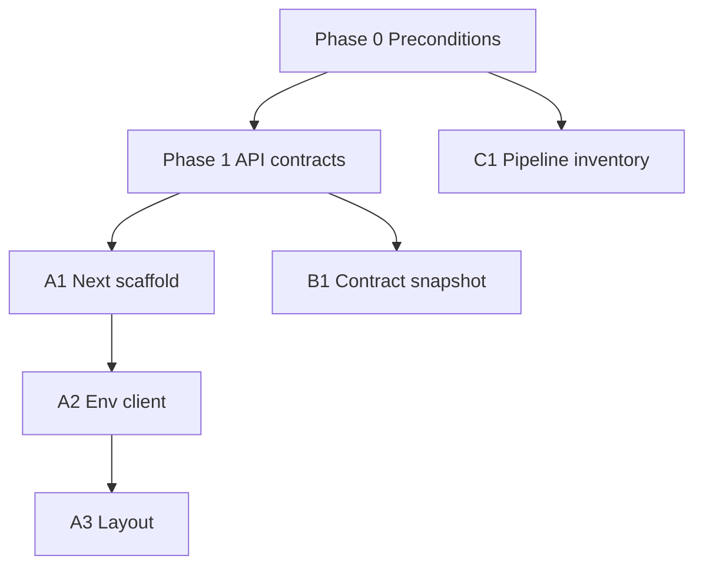

# Workstream breakdown (parallel tracks)

Use this file to **divide ownership** while keeping a single ordered checkpoint list in [MIGRATION_PHASES_AND_CHECKPOINTS.md](MIGRATION_PHASES_AND_CHECKPOINTS.md).

**Last updated:** March 24, 2026

---

## Track A — Web platform (Next.js + UI)

**Scope:** New app shell, routing, design system (Tailwind + Stitch tokens), migrating screens from Create React App, removing duplicate UIs when cutover is done.

| Work unit | Depends on | Produces |
|-----------|------------|----------|
| A1. Next.js app scaffold | Phase 0–1 complete | Runnable `web/` (or chosen path) with dev server |
| A2. Env + API client | A1, Track B1 | `NEXT_PUBLIC_*` + shared fetch/axios client |
| A3. App layout + nav | A2, Phase 4 design tokens | Sidebar/shell matching mockups |
| A4. Route-by-route migration | A3 | Feature parity vs `frontend/src/CustomizableQuantumDashboard.js` |
| A5. CRA deprecation | A4 stable | Single frontend entry; docs updated |

**Checkpoint sync:** After **A2**, **A4** (50% routes), and **A5** — run full **Web** verification from the master phases doc.

---

## Track B — API & contracts (Flask)

**Scope:** Stable JSON contracts, documented env vars, smoke/integration tests stay green; optional OpenAPI alignment; no business-logic duplication in Next Route Handlers unless justified (BFF only).

| Work unit | Depends on | Produces |
|-----------|------------|----------|
| B1. Contract snapshot | Phase 0 | Documented request/response for critical paths (`/api/health`, `/api/portfolio/optimize`, market data) |
| B2. CORS & auth alignment | B1 | Dev/prod CORS rules documented; JWT/API key flows match frontend needs |
| B3. Job/poll patterns | Existing `api.py` jobs | Documented status endpoints for long runs (if used by UI) |

**Checkpoint sync:** End of **Phase 1** and before **Phase 6** production cutover — run `scripts/test_api_integration.py` and pytest API tests.

---

## Track C — Data pipeline & persistence

**Scope:** Clarify what runs **online** (Flask) vs **offline** (scripts, batch); shared DB/paths for deploy; no pipeline logic inside Next.js except triggering jobs via API.

| Work unit | Depends on | Produces |
|-----------|------------|----------|
| C1. Pipeline inventory | — | List: scripts, cron, inputs/outputs, SQLite vs future DB |
| C2. API vs pipeline boundary | C1 | Diagram or short doc: who writes `data/api.sqlite3` (or successor) |
| C3. CI hooks (optional) | C1 | Lint/test gates for Python on PR (see master phases) |

**Checkpoint sync:** **Phase 7** — pipeline doc reviewed; no blocking ambiguity for deploy.

---

## Dependency graph (simplified)

---

## Suggested ownership (fill in names)

| Track | Owner | Backup |
|-------|-------|--------|
| A — Web | | |
| B — API | | |
| C — Pipeline | | |

Review at each **checkpoint** in [MIGRATION_PHASES_AND_CHECKPOINTS.md](MIGRATION_PHASES_AND_CHECKPOINTS.md).
